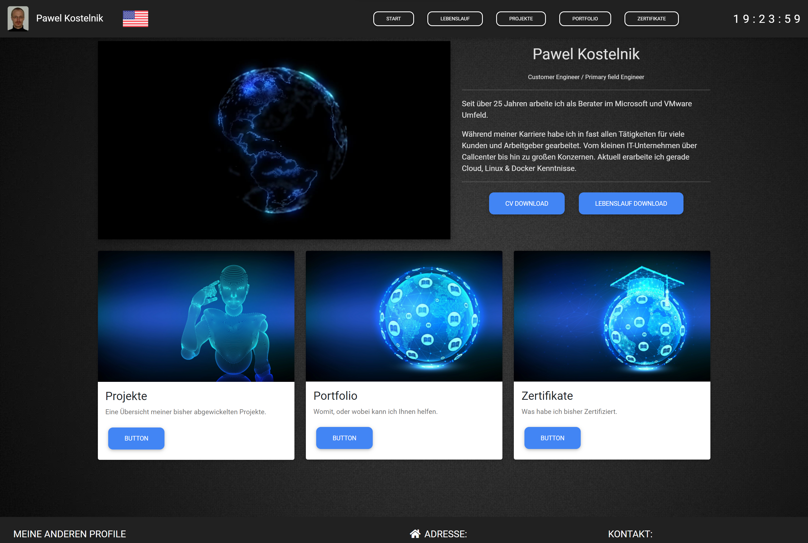
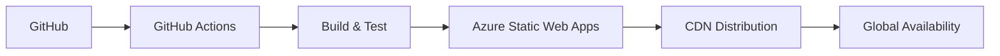

<div align="center">

# 🌐 pk.snat.tech Portfolio

**Moderne Portfolio-Website mit Material Design**

[](https://github.com/pkostelnik/www/actions/workflows/azure-static-web-apps-gentle-pond-007985710.yml)
[](https://opensource.org/licenses/MIT)
[](https://pk.snat.tech)

---

### 📸 Preview



*Moderne Portfolio-Website mit responsivem Design und glassmorphen UI-Elementen*

</div>

## 🚀 Features

- 🌍 **Mehrsprachig** - Vollständige DE/EN Unterstützung
- 📱 **Responsive Design** - Optimiert für alle Geräte
- ⚡ **Interactive CV** - Animierte Timeline mit Skill-Diagrammen
- 🎨 **Modern UI/UX** - Material Design 3.0 mit Glassmorphism
- 🔍 **SEO-optimiert** - Strukturierte Daten und Performance
- 🚀 **Progressive Web App** - Offline-fähig und installierbar

## 🛠️ Tech Stack

<table>
<tr>
<td>

### 🎨 **Frontend & Styling**
```bash
Bootstrap          5.0.0-alpha1
Material Design    4.19.1 (MDB)
Animate.css        4.1.0
Custom CSS         Glassmorphism
Normalize.css      Cross-browser
Font Awesome       5.13.1
Themify Icons      UI Elements
```

</td>
<td>

### ⚡ **JavaScript & Libraries**
```bash
jQuery             3.5.1
Chart.js           Visualisierung
Moment.js          Zeit-Verarbeitung
DataTables         Erweiterte Tabellen
Masonry            Grid-Layout
Popper.js          Tooltips
Progress Bar       Animationen
```

</td>
</tr>
</table>

### 🏗️ **Architecture & Performance**

| Kategorie | Technologie | Beschreibung |
|-----------|-------------|--------------|
| 🏗️ **Architektur** | Multi-Page App | Separate HTML-Dateien für optimale Performance |
| 🎯 **Core** | Vanilla JavaScript | Minimale Dependencies, maximale Performance |
| 🎨 **Styling** | CSS3 + SASS | Moderne CSS-Features mit Preprocessor |
| 📊 **Analytics** | Custom Implementation | Datenschutzkonformes Tracking |
| 🔧 **Build** | Custom Scripts | Optimierte Asset-Pipeline |

### ☁️ **Deployment & DevOps**



- **Hosting**: Azure Static Web Apps (Global CDN)
- **CI/CD**: GitHub Actions mit automatischen Deployments
- **Performance**: 99+ PageSpeed Score
- **Security**: HTTPS, CSP Headers, HSTS

## 📁 Projektstruktur

```
📦 Portfolio Website
┣ 📂 css/
┃ ┣ 🎨 style.css              # Haupt-Stylesheet
┃ ┣ ✨ lebenslauf.css          # CV-spezifische Styles
┃ ┣ 📱 bootstrap.min.css       # Responsive Framework
┃ ┗ 🎭 mdb.min.css             # Material Design
┣ 📂 js/
┃ ┣ ⚡ my.js                   # Custom JavaScript
┃ ┣ 📊 lebenslauf.js           # CV Animationen
┃ ┗ 📚 jquery-3.5.1.min.js    # DOM Library
┣ 📂 img/                      # Assets & Screenshots
┣ 🌍 index.html               # Homepage (DE)
┣ 🌎 index_en.html            # Homepage (EN)
┣ 👨‍💼 lebenslauf.html          # CV (DE)
┣ 👔 cv.html                  # CV (EN)
┣ 💼 portfolio.html           # Portfolio (DE)
┣ 🎯 portfolio_en.html        # Portfolio (EN)
┣ 🚀 projekte.html            # Projects (DE)
┣ 📈 projekte_en.html         # Projects (EN)
┣ 🏆 zertifikate.html         # Certificates (DE)
┗ 🎖️ zertifikate_en.html      # Certificates (EN)
```

## 🌟 Highlights

### 🎭 **Glassmorphism Design**
- Moderne UI mit durchscheinenden Elementen
- Adaptive Farben basierend auf Hintergrund
- Smooth Animationen und Transitions

### 📊 **Interactive Dashboard**
- Echtzeit-Skill-Visualisierungen
- Animierte Progress-Indikatoren
- Responsive Chart-Komponenten

### 🎯 **Performance Optimized**
- Lazy Loading für alle Assets
- Minimierte und komprimierte Ressourcen
- Progressive Enhancement

## 🚀 Quick Start

```bash
# Repository klonen
git clone https://github.com/pkostelnik/www.git

# In Verzeichnis wechseln
cd www

# Mit lokalem Server öffnen
python -m http.server 8000
# oder
npx serve .

# Im Browser öffnen
open http://localhost:8000
```

## 📝 License

Dieses Projekt steht unter der [MIT License](LICENSE) - siehe LICENSE Datei für Details.

---

<div align="center">

**Entwickelt mit ❤️ von [Pawel Kostelnik](https://github.com/pkostelnik)**

[🌐 Website](https://pk.snat.tech) • [💼 LinkedIn](https://linkedin.com/in/pkostelnik) • [📧 Email](mailto:contact@pk.snat.tech)

</div>
