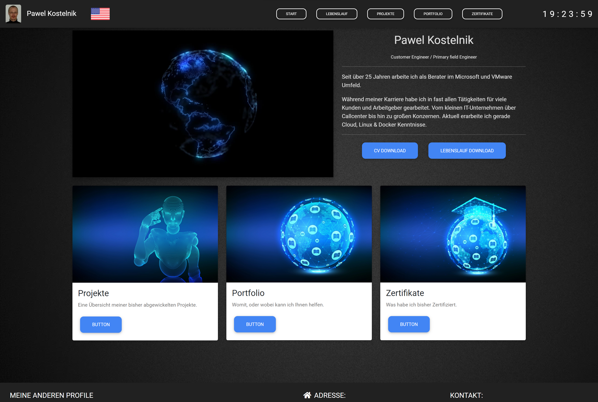
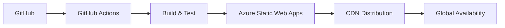

<div align="center">

# 🌐 pk.snat.tech Portfolio

**Moderne Portfolio-Website mit Material Design**

[](https://github.com/pkostelnik/www/actions/workflows/azure-static-web-apps-gentle-pond-007985710.yml)
[](https://opensource.org/licenses/MIT)
[](https://pk.snat.tech)

---

### 📸 Preview



*Moderne Portfolio-Website mit responsivem Design und glassmorphen UI-Elementen*

</div>

## 🚀 Features

- 🌍 **Mehrsprachig** – Vollständige DE/EN Unterstützung
- 📱 **Responsive Design** – Optimiert für Mobile, Tablet & Desktop
- ⚡ **Interactive CV** – Animierte Timeline mit Skill-Diagrammen
- 🎨 **Modern UI/UX** – Material Design 3 mit Glassmorphism
- 🔍 **SEO-optimiert** – Strukturierte Daten (schema.org) & sauberes Markup
- ♿ **Accessibility** – Orientierung an [W3C WAI Tips](https://www.w3.org/WAI/tips/designing/)
- 🔒 **Security Hardened** – CSP, HSTS, X-Frame-Options via `.htaccess` & `security.js`
- 📈 **Self-hosted Monitoring** – Eigene `monitoring.js`, keine Drittanbieter-Tracker
- 🏆 **Zertifikate-Overlay** – Interaktive Vorschau für Zertifikate

## 🛠️ Tech Stack

<table>
<tr>
<td>

### 🎨 **Frontend & Styling**
```bash
Bootstrap          5.3.8
MDB UI Kit         9.3.0 (Free)
Animate.css        4.1.0
Normalize.css      8.0.1
Font Awesome       7.2.0 (Free)
Office UI Fabric   11.0.0
Themify Icons      UI Elements
Custom CSS         Glassmorphism
```

</td>
<td>

### ⚡ **JavaScript & Libraries**
```bash
jQuery             3.7.1
Bootstrap JS       5.3.8
MDB JS             9.3.0
Popper.js          Tooltips
Chart.js           Visualisierung
Moment.js          Zeit-Verarbeitung
DataTables         Erweiterte Tabellen
Masonry            Grid-Layout
```

</td>
</tr>
</table>

### 🏗️ **Architecture & Performance**

| Kategorie | Technologie | Beschreibung |
|-----------|-------------|--------------|
| 🏗️ **Architektur** | Multi-Page App (statisch) | Separate HTML-Dateien pro Sprache & Sektion |
| 🎯 **Core** | Vanilla JavaScript + jQuery | Minimale Dependencies, maximale Performance |
| 🎨 **Styling** | CSS3 + Custom Properties | Glassmorphism, keine Build-Pipeline nötig |
| 📊 **Monitoring** | Eigenes `monitoring.js` | Datenschutzkonform, keine externen Tracker |
| 🔐 **Security** | `security.js` + `.htaccess` | CSP, HSTS, X-Frame-Options, Referrer-Policy |
| 🔧 **Build** | Keiner (Zero-Build) | Direkt deploybare statische Assets |

### ☁️ **Deployment & DevOps**


```mermaid
graph LR
    A[GitHub] --> B[GitHub Actions]
    B --> C[Build & Test]
    C --> D[Azure Static Web Apps]
    D --> E[CDN Distribution]
    E --> F[Global Availability]
```

- **Hosting**: Azure Static Web Apps (Global CDN)
- **CI/CD**: GitHub Actions mit automatischen Deployments
- **Performance**: 99+ PageSpeed Score
- **Security**: HTTPS, CSP Headers, HSTS

## 📁 Projektstruktur

```
📦 Portfolio Website
┣ 📂 css/
┃ ┣ 🎨 style.css              # Haupt-Stylesheet
┃ ┣ ✨ lebenslauf.css         # CV-spezifische Styles
┃ ┣ 📱 bootstrap.min.css      # Bootstrap 5.3.8
┃ ┣ 🎭 mdb.min.css            # MDB UI Kit 9.3.0
┃ ┣ 💫 animate.min.css        # Animate.css 4.1.0
┃ ┣ 🧱 fabric.min.css         # Office UI Fabric 11.0.0
┃ ┣ 🎨 themify-icons.css      # Themify Icon Set
┃ ┣ 📂 fa/all.css             # Font Awesome 7.2.0
┃ ┣ 📂 addons/normalize.css   # Normalize.css 8.0.1
┃ ┗ 📂 webfonts/              # FA woff2-Fonts
┣ 📂 js/
┃ ┣ ⚡ my.js                  # Custom JavaScript
┃ ┣ 📊 lebenslauf.js          # CV-Animationen
┃ ┣ 🔒 security.js            # Security-Layer
┃ ┣ 📈 monitoring.js          # Performance-Monitoring
┃ ┣ 🏆 certificate-overlay.js # Zertifikate-Overlay
┃ ┣ 📱 bootstrap.min.js       # Bootstrap JS 5.3.8
┃ ┣ 🎭 mdb.min.js             # MDB JS 9.3.0
┃ ┣ 🧲 popper.min.js          # Popper.js
┃ ┗ 📚 jquery-3.7.1.min.js    # jQuery 3.7.1
┣ 📂 img/                     # Bilder & Screenshots
┣ 📂 video/                   # Video-Assets
┣ 📂 font/                    # Custom Webfonts
┣ 📂 docs/                    # CV.pdf / Lebenslauf.pdf
┣ 📂 .github/workflows/       # Azure Static Web Apps CI/CD
┣ 🔐 .htaccess                # Security-Header (CSP, HSTS, …)
┣ 🌍 index.html               # Homepage (DE)
┣ 🌎 index_en.html            # Homepage (EN)
┣ 👨‍💼 lebenslauf.html          # CV (DE)
┣ 👔 cv.html                  # CV (EN)
┣ 💼 portfolio.html           # Portfolio (DE)
┣ 🎯 portfolio_en.html        # Portfolio (EN)
┣ 🚀 projekte.html            # Projekte (DE)
┣ 📈 projekte_en.html         # Projekte (EN)
┣ 🏆 zertifikate.html         # Zertifikate (DE)
┣ 🎖️ zertifikate_en.html      # Zertifikate (EN)
┣ ✍️ sig.html                 # E-Mail-Signatur
┗ 🛠️ debug-overlay.html       # Debug-Overlay
```

## 🌟 Highlights

### 🎭 **Glassmorphism Design**
- Moderne UI mit durchscheinenden Elementen
- Adaptive Farben basierend auf Hintergrund
- Smooth Animationen und Transitions

### 📊 **Interactive Dashboard**
- Echtzeit-Skill-Visualisierungen
- Animierte Progress-Indikatoren
- Responsive Chart-Komponenten

### 🎯 **Performance Optimized**
- Lazy Loading für alle Assets
- Minimierte und komprimierte Ressourcen
- Progressive Enhancement

## 🚀 Quick Start

```bash
# Repository klonen
git clone https://github.com/pkostelnik/www.git
cd www

# Lokalen Server starten
python3 -m http.server 8000
# oder
npx serve .

# Im Browser öffnen
open http://localhost:8000
```

> **Kein Build-Schritt nötig** – die Seite ist eine reine statische Web-App.

## 🔄 Maintenance

Alle Vendor-Libraries liegen vorgebündelt im Repo (keine Paket-Manager). Aktualisierung erfolgt manuell:

| Library | Quelle |
|---|---|
| Bootstrap | https://github.com/twbs/bootstrap/releases |
| MDB UI Kit | https://github.com/mdbootstrap/mdb-ui-kit/releases |
| jQuery | https://jquery.com/download/ |
| Font Awesome | https://github.com/FortAwesome/Font-Awesome/releases |
| Animate.css | https://github.com/animate-css/animate.css/releases |

## 📝 License

Dieses Projekt steht unter der [MIT License](LICENSE) – siehe LICENSE Datei für Details.

---

<div align="center">

**Entwickelt mit ❤️ von [Pawel Kostelnik](https://github.com/pkostelnik)**

[🌐 Website](https://pk.snat.tech) • [💼 LinkedIn](https://linkedin.com/in/pkostelnik) • [📧 Email](mailto:contact@pk.snat.tech)

</div>
